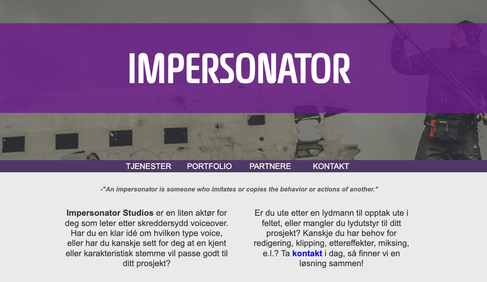

## Impersonator

[To website](https://pholdahl.github.io/impersonator/)

## Table of Contents

- [About the Project](#about-the-project)
- [Features](#features)
- [Technology Used](#technology-used)
- [Design and Responsiveness](#design-and-responsiveness)
- [Contributors](#contributors)
- [License](#license)

## About the Project

**Impersonator** is a business promotional website created for a friend and co-worker involved in voice acting and on-site recording. The website provides information about the services offered by Impersonator, showcases example sound recordings and business partners, and offers contact information.

## Features

- **Service Information:** Detailed descriptions of the voice acting and recording services provided.
- **Showcase of Work:** Includes sample audio recordings using HTML5 audio elements.
- **Business Partners:** Displays logos or information about business partners.
- **Contact Information:** Provides a way for potential clients to get in touch.
- **Interactive Navigation:** Smooth scrolling and navigation features implemented with Vanilla JavaScript.

## Technology Used

- **HTML5:** For structuring the webpage content.
- **CSS:** For styling and layout.
- **JavaScript:** For interactive elements and navigation.
- **Images:** Sourced from [unsplash.com](https://unsplash.com/).
- **Font:** Magistral, from [onlinewebfonts.com](https://www.onlinewebfonts.com/).

## Design and Responsiveness

Even before starting formal education in Software Engineering, the focus was on creating a responsive website. The webpage was designed with a mobile-first approach, ensuring it looks great on cellphones and then adjusting for larger screens. The design features a thorough color palette using gray tones, white, and purple accent colors. The structure of the page is achieved through a combination of CSS Grid, relative, and absolute positioning. The webpage uses cards to highlight the different services offered by the business.

## Contributors

- This project was developed by [Pholdahl](https://github.com/pholdahl).

## License

This project is licensed under the MIT License.
